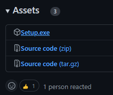
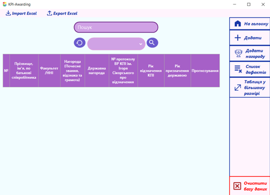

<h1 align="center">KPI-Awarding</h1>

**Project on the subject "Numerical analysis"**, 3rd semester<br>


**Using this repo you agree not to violate the rules of academic integrity.**
Not for commercial use.

<h2>Tech stack:</h2>

- C#
- DB: SQLite
- ADO.NET
- Windows Forms

<h2>How to install</h2>

1. Download `setup.exe` from `latest`:<br><br>
   <br><br>
2. Install
3. 🎉

<h2>How to use</h2>

**Technical specifications:** [\*Link\*](https://github.com/xairaven/KPI-Awarding/tree/main/readme-res/Task.docx)

User interface is **intuitive**:<br><br>
<br><br>

But anyway, you can read the **manual**: [\*Link\*](https://github.com/xairaven/KPI-Awarding/tree/main/readme-res/Manual.docx)

<h2>Requirements</h2>
<h3>For use:</h3>

- **.NET Framework 4.8**

<h3>For development</h3>

- **.NET Framework 4.8 SDK**

<h2>Contributions</h2>

**Contributions are welcome!** 🎉

It's better to create an issue with description of your **bug/feature** before creating pull requests.

<h3>About branching</h3>

This project uses **TBD git strategy**.

Each contributor should have a branch. **Naming example:** ```feat/<nickname>```